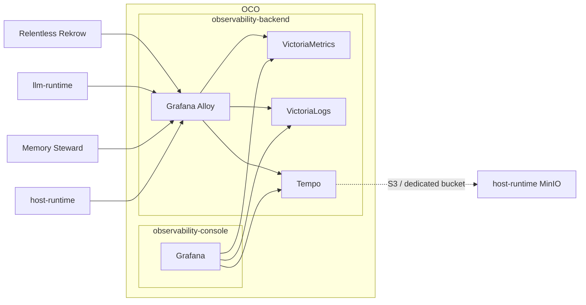

# OCO

[](https://github.com/homel-dev/oco/actions/workflows/ci.yml)

## Shared Observability Platform for Homel Projects

OCO owns the shared observability platform for Homel projects.

It intentionally separates the presentation plane from the telemetry data plane:

```text
observability-console
└── Grafana

observability-backend
├── Grafana Alloy
├── VictoriaMetrics
├── VictoriaLogs
└── Grafana Tempo
```

The repository owns both namespaces. The namespaces do not share lifecycle.

> **Hard invariant:** loss or deletion of `observability-console` MUST NOT stop
> telemetry ingestion or destroy telemetry retained by `observability-backend`.

## Architecture



## Ownership boundary

OCO owns:

- shared telemetry ingress and routing;
- common telemetry identity conventions;
- VictoriaMetrics, VictoriaLogs, and Tempo deployment;
- retention and storage conventions;
- shared Grafana datasources;
- backend NetworkPolicy;
- Grafana presentation/provisioning machinery.

Consumer projects own:

- instrumentation;
- telemetry semantics;
- project-specific dashboards and alerts;
- project-specific correlation attributes;
- exceptional application-owned datasources.

The common identity vocabulary is:

- `project`
- `service.name`
- `k8s.namespace.name`
- `deployment.environment.name`

Correlation identifiers such as `run_id`, trace IDs, request IDs, and planning
cycle IDs remain signal attributes. They MUST NOT be promoted indiscriminately
to global metric labels.

## Standard backends

| Signal | Shared backend | Working storage |
|---|---|---|
| Metrics | VictoriaMetrics Single Node | PVC/filesystem |
| Logs | VictoriaLogs Single Node | PVC/filesystem |
| Traces | Tempo monolithic | PVC in base deployment; MinIO overlay available |
| Ingress/processing | Grafana Alloy | ephemeral local state |

VictoriaMetrics and VictoriaLogs are deliberately single-node. OCO does not
deploy their cluster modes in the current single-node Minikube environment.

Tempo remains the trace backend. The base deployment can start without
host-runtime MinIO; `k8s/overlays/tempo-minio` switches trace block
storage to the dedicated `observability-tempo` bucket once credentials exist.

## Grafana datasources

Grafana provisions shared standard datasources:

- `victoriametrics`
- `victorialogs`
- `tempo`

Standard telemetry is separated by metadata, not by deploying one standard
datasource/backend per project.

Project-specific application data may remain a dedicated datasource when that
data belongs to the application itself.

## Deployment

Existing console deployment remains available:

```bash
task up
```

Deploy the backend:

```bash
task backend:up
```

Deploy both:

```bash
task platform:up
```

Run static repository and manifest validation before deployment:

```bash
task ci:validate
```

Validate actual signal paths against the running cluster:

```bash
task backend:smoke
task backend:baseline
```

`Running` Pods are not completion criteria. The smoke test validates:

```text
OTLP producer -> Alloy -> VictoriaMetrics -> query
OTLP producer -> Alloy -> VictoriaLogs    -> query
OTLP producer -> Alloy -> Tempo           -> query
```

## Migration

Consumers migrate one at a time. A working project-local backend is removed
only after telemetry parity through OCO has been demonstrated.

Do not simultaneously migrate every project.

## Documentation

- [docs/01_overview.md](docs/01_overview.md) — historical presentation-only architecture; explicitly superseded
- [docs/02_shared_observability_platform.md](docs/02_shared_observability_platform.md) — current platform architecture
- [docs/03_backend_operations.md](docs/03_backend_operations.md) — deployment and validation
- [docs/04_consumer_migration.md](docs/04_consumer_migration.md) — per-project migration contract
- [docs/05_ci.md](docs/05_ci.md) — CI architecture and validation contract

Organization-wide policy:

- [Engineering Style Guide](https://github.com/homel-dev/.github/blob/main/docs/01_engineering_style_guide.md)
- [Documentation Style Guide](https://github.com/homel-dev/.github/blob/main/docs/02_documentation_style_guide.md)
- [Repository Conventions](https://github.com/homel-dev/.github/blob/main/docs/03_repository_conventions.md)
