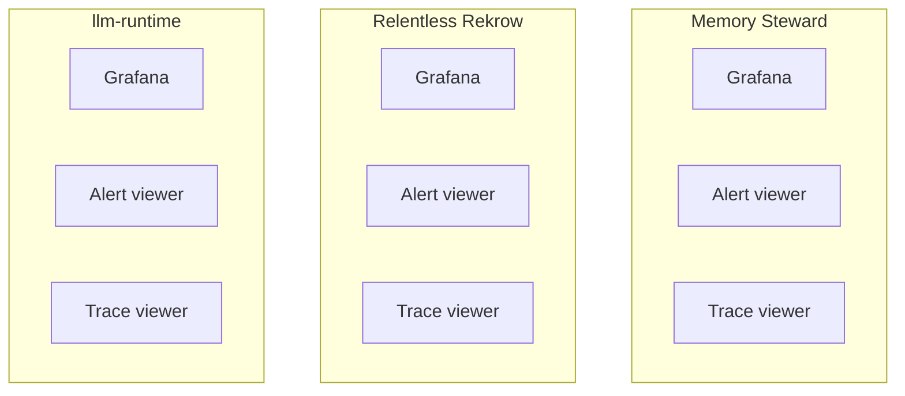
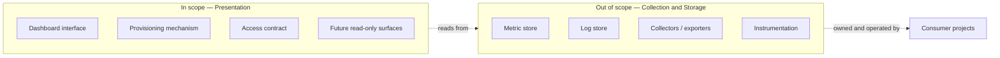
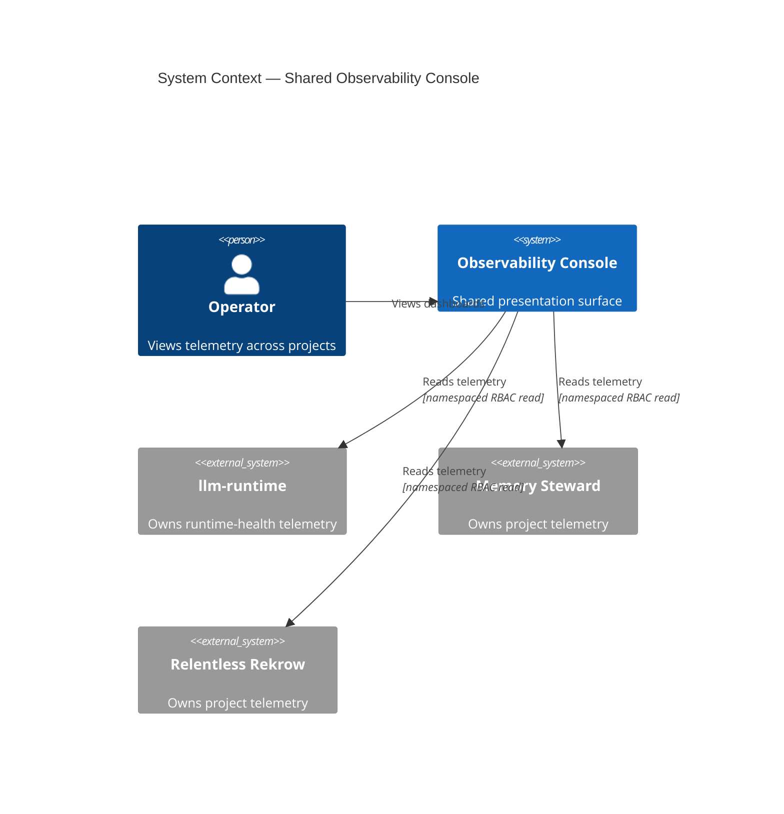
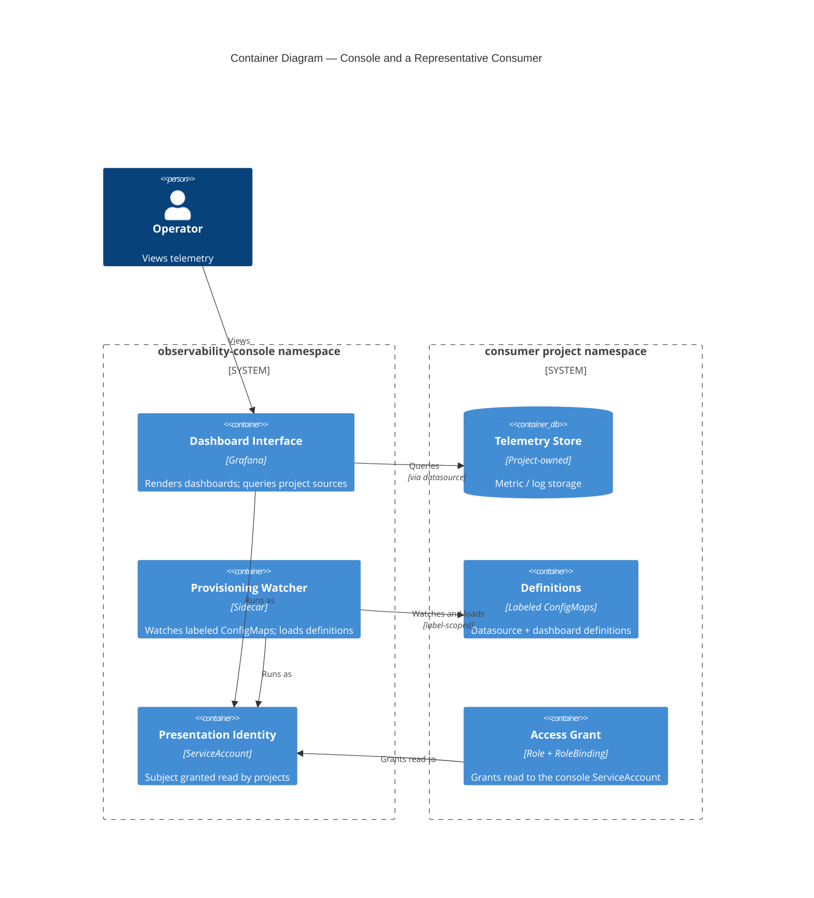
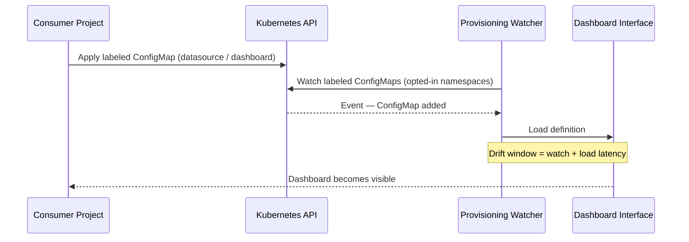
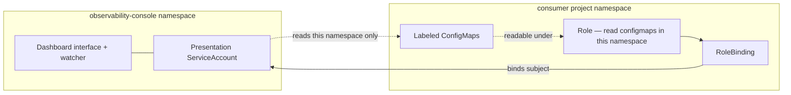
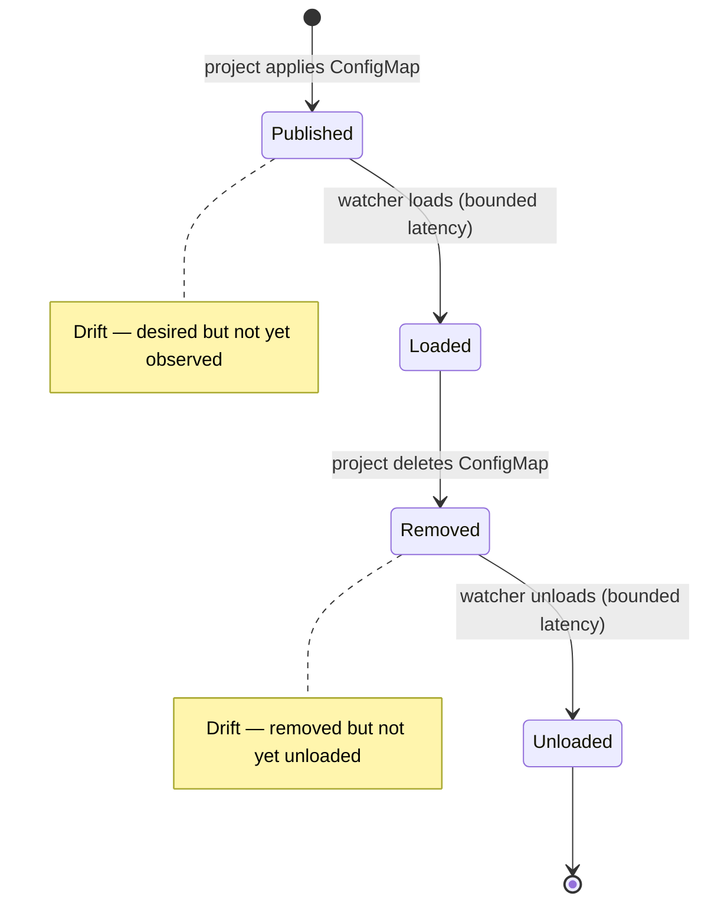
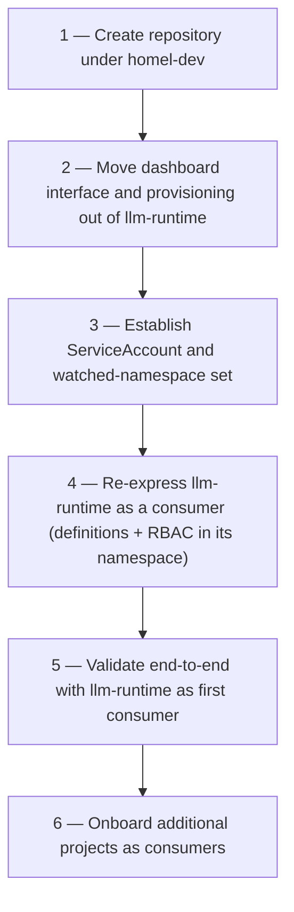

# OBSERVABILITY CONSOLE

## Architecture Overview

> **Status: SUPERSEDED.** This document records the original presentation-only
> architecture. [Document 02](02_shared_observability_platform.md) is the
> current canonical architecture. The previous prohibition on OCO-owned stores
> and collectors no longer applies. Content below this notice is retained as
> architectural decision history and MUST NOT be treated as current scope.


### Foundational Engineering Specification (Document 01 of 01)

*Namespace: observability-console • Owner: platform*

-----

## Navigation

**← [Prev: README](../README.md)**

- [0. Status, Scope, and Authority](#0-status-scope-and-authority)
- [1. Purpose](#1-purpose)
- [2. Design Goals](#2-design-goals)
- [3. Problem Statement](#3-problem-statement)
- [4. Core Principles](#4-core-principles)
- [5. Scope Boundary — Presentation vs Storage](#5-scope-boundary--presentation-vs-storage)
- [6. Architecture Model](#6-architecture-model)
- [7. Provisioning Contract](#7-provisioning-contract)
- [8. Access Model](#8-access-model)
- [9. Consumption Model](#9-consumption-model)
- [10. Ownership Boundary](#10-ownership-boundary)
- [11. Reconciliation and Drift](#11-reconciliation-and-drift)
- [12. Tradeoffs, Costs, and Failure Modes](#12-tradeoffs-costs-and-failure-modes)
- [13. Non-Goals](#13-non-goals)
- [14. Relationship to llm-runtime](#14-relationship-to-llm-runtime)
- [15. Current State and Migration](#15-current-state-and-migration)
- [16. Future Expansion](#16-future-expansion)
- [17. Closing Statement](#17-closing-statement)

-----

## 0. Status, Scope, and Authority

**Status:** FOUNDATIONAL
**Audience:** Platform contributors, infrastructure contributors, consumer-project maintainers
**Change policy:**

- Append-only
- No silent edits

This document defines the canonical architecture for the shared observability presentation layer. It concerns the **presentation and control-plane layer** only. It MUST NOT be read as defining collectors, metric stores, log stores, instrumentation, or project-specific telemetry semantics.

[Back to top](#navigation)

-----

## 1. Purpose

Multiple Homel projects emit telemetry. Examples: llm-runtime, Memory Steward, Relentless Rekrow, Intent Steward, The Dean.

Without a shared presentation layer, each project tends to deploy its own viewer stack — a dashboard interface, an alert interface, a trace interface. The viewer binaries duplicate; the data does not need to.

This project provides one presentation surface that reads from telemetry sources owned and operated by independent projects. Those projects retain full ownership of what is collected and what it means.

The viewer is shared. Telemetry ownership remains with projects.

[Back to top](#navigation)

-----

## 2. Design Goals

1. one presentation surface across projects
1. elimination of duplicate viewer deployments
1. project-owned dashboards and datasource definitions
1. project-owned least-privilege access grants
1. presentation availability decoupled from telemetry retention
1. predictable onboarding for new consumer projects
1. controlled growth of presentation components over time

The architecture prioritizes a single operator surface while preserving project autonomy over telemetry meaning.

[Back to top](#navigation)

-----

## 3. Problem Statement

Without a shared presentation layer, projects tend to deploy independent viewer stacks. The duplicated component is the viewer, not the data.



This produces duplicate viewer deployments, a fragmented operator experience, inconsistent dashboard provisioning, N places to log in to answer one question, and inconsistent access wiring per project.

This architecture separates the **presentation surface** from **telemetry collection and storage**.

[Back to top](#navigation)

-----

## 4. Core Principles

### 4.1 Presentation Is Shared

Viewer and control-plane components are a shared platform capability. Projects consume the presentation surface. Projects SHOULD NOT deploy their own viewer stacks.

### 4.2 Storage Is Not Shared

Collection and storage remain inside the projects that own them. This project MUST NOT host a metric store, a log store, or a collector.

### 4.3 Project-Owned Meaning

Dashboard content, datasource definitions, and alert intent carry project semantics. The consuming project owns them, not this project.

### 4.4 Least Privilege by Default

A project grants read access to its telemetry in its own namespace, scoped to that namespace. The presentation layer MUST hold no cluster-wide read authority by default.

### 4.5 Availability Independence

Loss of the presentation surface MUST NOT imply loss of telemetry. Because collection and storage remain in projects, a presentation outage removes visibility, not data.

[Back to top](#navigation)

-----

## 5. Scope Boundary — Presentation vs Storage

This is the central invariant of the project.



In scope: the dashboard interface (initially Grafana), the provisioning mechanism that loads project-published definitions, the access contract by which projects grant read access, and future presentation surfaces such as an alert interface or a trace interface.

Out of scope: metric stores, log stores, exporters and collectors, instrumentation libraries, and telemetry retention and lifecycle.

> **Hard Invariant:** This repository MUST NOT introduce a store or collector. A reviewer MUST be able to delete this entire project and lose no telemetry data — only the ability to view it.

This invariant is enforced by **process**: any change introducing a store or collector into this repository is a scope violation and MUST be rejected in review.

[Back to top](#navigation)

-----

## 6. Architecture Model

This project introduces a dedicated Kubernetes namespace for presentation components. The presentation surface reads from project-owned sources that reside in project namespaces.

### 6.1 System Context



### 6.2 Containers



[Back to top](#navigation)

-----

## 7. Provisioning Contract

A consumer project publishes presentation definitions as labeled ConfigMaps in its own namespace. Two definition classes are recognized:

```text
datasource definition
dashboard definition
```

Each definition MUST be published as a ConfigMap carrying the agreed label key that marks it for collection. The presentation Control Plane watches for labeled ConfigMaps and loads them.



State vocabulary:

- **Desired State:** the union of labeled ConfigMaps across opted-in namespaces
- **Observed State:** the definitions currently loaded by the presentation surface
- **Reconciliation:** a watch-and-load process co-located with the presentation surface
- **Drift:** a published definition not yet loaded, or a removed definition not yet unloaded

The consuming project decides the content of a definition. The presentation layer decides nothing about content; it loads what projects publish.

This contract is enforced by **protocol**: a definition without the agreed label is not collected, and a labeled definition in a non-watched namespace is not collected.

[Back to top](#navigation)

-----

## 8. Access Model

A project grants read access in its own namespace.



**Authority:** the consuming project.

**Mechanism:** a namespaced Role granting read on the relevant resources in that namespace, bound by a RoleBinding whose subject is the presentation surface ServiceAccount, which resides in the `observability-console` namespace.

> **Hard Invariant:** The presentation layer MUST hold no cluster-wide read grant by default.

A RoleBinding grants access only within its own namespace, even when its subject lives elsewhere. This property lets a project attach access to its own telemetry without widening the presentation layer’s authority.

**Who decides:** the project decides whether to be visible, by shipping the Role and RoleBinding.

**Enforcement:** RBAC (protocol).

**On failure:** if a project does not ship the binding, the presentation surface is denied read in that namespace; that project’s panels do not appear; other projects are unaffected. The failure is isolated and visible.

**Audit Spine:** the set of RoleBindings naming the presentation ServiceAccount is the authoritative, inspectable record of which projects have opted into visibility.

[Back to top](#navigation)

-----

## 9. Consumption Model

To be served, a project MUST ship, in its own namespace:

1. a datasource definition (labeled ConfigMap)
1. one or more dashboard definitions (labeled ConfigMaps)
1. a Role granting read on those resources in the namespace
1. a RoleBinding to the presentation ServiceAccount

Onboarding a project additionally requires adding the project’s namespace to the presentation surface’s watched-namespace set. This is a deliberate coupling point, recorded in [Section 12](#12-tradeoffs-costs-and-failure-modes).

A project that ships these artifacts becomes visible. A project that removes them becomes invisible, without affecting any other project.

[Back to top](#navigation)

-----

## 10. Ownership Boundary

Projects own: datasource definitions, dashboard content, alert intent, telemetry collection, telemetry storage and retention, and the access grant to their own namespace.

This project owns: the presentation surfaces, the provisioning mechanism, the watched-namespace set, the presentation ServiceAccount identity, and presentation availability and recovery.

The boundary is stated as:

```text
observability-console owns how telemetry is viewed.
Consumer projects own what telemetry is, and what it means.
```

[Back to top](#navigation)

-----

## 11. Reconciliation and Drift

The presentation surface converges Observed State toward Desired State by watching labeled ConfigMaps and loading them.



> **Hard Invariant:** Drift is bounded, not eliminated. Reconciliation MUST NOT be described as instantaneous.

A newly published definition appears after a bounded watch-and-load latency. A removed definition is unloaded after a bounded watch-and-load latency. During that window, Observed State lags Desired State.

This project MUST NOT hold a separate copy of project definitions. Definitions are read in place from project namespaces. There is therefore no second source of truth to fall out of sync.

[Back to top](#navigation)

-----

## 12. Tradeoffs, Costs, and Failure Modes

### 12.1 Weakness — Concentrated Read Surface

A single presentation surface can read all telemetry of all opted-in projects. Under single-organization viewer authentication, any console user can see all loaded telemetry. This is accepted at current scale (single operator, single organization). It becomes a cost at the first multi-user or multi-tenant boundary, at which point folder-level or organization-level access separation is required.

### 12.2 Operational Cost — Per-Project Wiring and the Watched-Namespace Set

Each consumer project MUST ship and maintain RBAC artifacts and labeled definitions. Onboarding a project mutates the presentation surface’s watched-namespace set. This set is a coupling point between this project and its consumers and MUST be maintained deliberately.

### 12.3 Failure Mode — Visibility Blast Radius

Unavailability of the presentation surface removes visualization for all projects at once. This is bounded by the scope invariant in [Section 5](#5-scope-boundary--presentation-vs-storage): collection and storage remain in projects, so telemetry is retained during a presentation outage. Recovery is redeployment of the presentation surface; no telemetry reconstruction is required.

[Back to top](#navigation)

-----

## 13. Non-Goals

This project is not a metric store, a log store, a collector or exporter, an authority over alert routing policy, or an instrumentation layer for distributed tracing.

Hosting an alert interface in the future MUST NOT make this project the owner of alert intent. Alert routing as shared state is an open question, deferred to [Section 16](#16-future-expansion).

[Back to top](#navigation)

-----

## 14. Relationship to llm-runtime

This project is a sibling shared-platform capability to llm-runtime. Both follow the same stance: infrastructure is shared, project behavior remains project-owned.

One asymmetry is deliberate. An inference request to a runtime tier is fungible: it carries no caller-specific meaning. Telemetry is not fungible: a dashboard and a datasource carry project-specific semantics.

Therefore only the **presentation surface** is shared here. The meaning of telemetry — dashboards, metric definitions, alert intent — remains owned by projects. Importing the llm-runtime model wholesale would over-centralize. This asymmetry is intentional.

[Back to top](#navigation)

-----

## 15. Current State and Migration

Presentation components currently reside inside the `llm-runtime` repository as a transitional arrangement. This document authorizes their extraction into this dedicated repository.



After migration, `llm-runtime` retains its runtime-health telemetry as a consumer and cedes ownership of the shared presentation surface.

> **Warning:** Migration MUST NOT move any store or collector into this repository. See [Section 5](#5-scope-boundary--presentation-vs-storage).

[Back to top](#navigation)

-----

## 16. Future Expansion

Future presentation surfaces MAY include an alert interface, a trace interface, or additional read-only operator surfaces.

> **Warning:** If an alert interface is hosted here, alert routing, silences, and receivers become shared state. Where routing authority lives — this project or the consuming projects — is not decided by this document.

Adding a surface MUST NOT alter the scope invariant. A surface is a viewer or control plane, never a store.

[Back to top](#navigation)

-----

## 17. Closing Statement

This document formalizes a shared telemetry presentation layer. The presentation surface is shared; telemetry collection, storage, content, and meaning remain owned by independent projects. A reviewer MUST be able to remove this project and lose visibility, never data. That property is the architecture.

-----

**END OF DOCUMENT 01**
