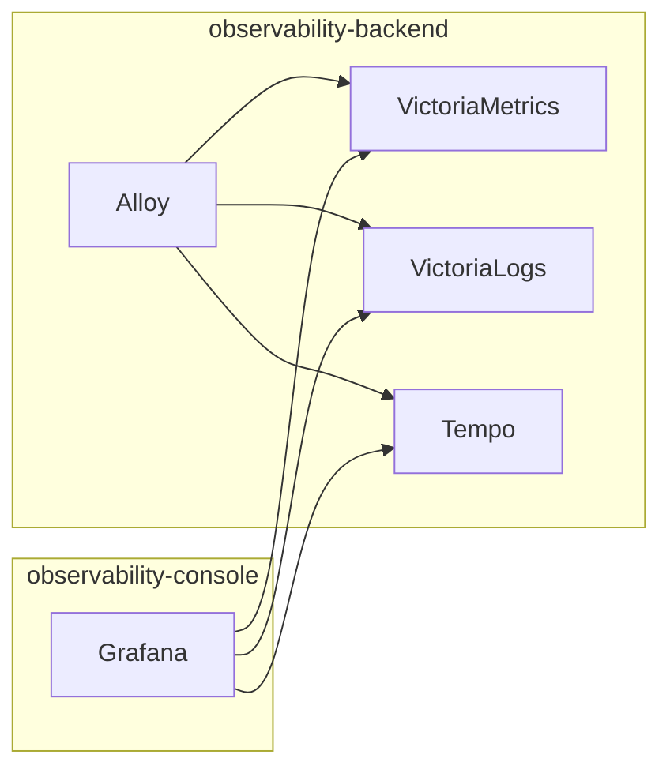

# OCO Shared Observability Platform

## Status

**Status:** CURRENT / FOUNDATIONAL

This document supersedes the presentation-only scope defined by Document 01.

OCO owns both the presentation plane and the standard telemetry data plane,
while keeping them isolated in separate Kubernetes namespaces.

## Namespace boundary



The critical failure invariant is:

> Loss of `observability-console` MUST NOT stop telemetry ingestion or destroy
> telemetry retained by `observability-backend`.

## Backend topology

The current single-node Minikube deployment uses:

- VictoriaMetrics Single Node for metrics;
- VictoriaLogs Single Node for logs;
- Tempo monolithic for traces;
- one shared Alloy Deployment as common ingress and processing;
- PVC-backed VM/VL working storage;
- PVC-backed Tempo storage in the base deployment;
- an optional Tempo MinIO overlay for the target object-store topology.

No component is deployed in unnecessary HA or cluster mode.

## Telemetry ingress

Preferred producer ingress is OTLP:

- gRPC: `alloy.observability-backend.svc:4317`
- HTTP: `alloy.observability-backend.svc:4318`

Compatibility ingress:

- Prometheus remote write:
  `http://alloy.observability-backend.svc:12347/api/v1/metrics/write`
- Loki push:
  `http://alloy.observability-backend.svc:12348/loki/api/v1/push`

Consumers SHOULD use OTLP when they do not require local scraping, file
collection, protocol conversion, enrichment, or buffering.

## Telemetry identity

Canonical resource identity is:

- `project`
- `service.name`
- `k8s.namespace.name`
- `deployment.environment.name`

For OTLP metrics Alloy copies only these four resource attributes onto metric
data points before Prometheus export. It does not promote arbitrary resource
attributes to metric labels.

For Kubernetes container logs Alloy preserves fields equivalent to:

- namespace
- pod
- container
- service
- project

If a Pod has no explicit
`observability.homel.dev/project` label, Kubernetes log `project` falls back to
the Pod namespace.

## Kubernetes logs and events

OCO uses a single Alloy Deployment rather than a DaemonSet because the current
cluster is one Minikube node.

The Pod mounts the node log files read-only:

```text
/var/log/pods
/var/log/containers
```

Kubernetes Events are also collected into VictoriaLogs.

## Storage

### VictoriaMetrics

- PVC: `victoriametrics-data`
- requested capacity: 50 GiB
- retention: 30 days
- free-space floor: 10 GiB (`-storage.minFreeDiskSpaceBytes=10GiB`)

### VictoriaLogs

- PVC: `victorialogs-data`
- requested capacity: 40 GiB
- retention: 14 days
- retention disk cap: 30 GiB (`-retention.maxDiskSpaceUsageBytes=30GiB`)
- free-space floor: 5 GiB (`-storage.minFreeDiskSpaceBytes=5GiB`)

### Tempo

Base deployment:

- PVC: `tempo-data`
- requested capacity: 20 GiB
- block retention: 7 days

Target MinIO overlay:

- S3-compatible endpoint: `minio.host-runtime.svc.cluster.local:9000`
- bucket: `observability-tempo`
- dedicated Secret: `tempo-minio`

Credentials and buckets MUST NOT be reused by unrelated consumers.

## Grafana datasources

OCO provisions three standard shared datasources:

| UID | Backend |
|---|---|
| `victoriametrics` | VictoriaMetrics |
| `victorialogs` | VictoriaLogs |
| `tempo` | Tempo |

Projects separate standard telemetry by metadata, not by private copies of the
standard backends.

Application-owned data remains an explicit datasource exception. OCO does not
create duplicate application databases merely to make the storage topology
symmetric.

## Network policy

`observability-backend` denies ingress by default.

Allowed ingress is:

- same-namespace backend communication;
- explicitly opted-in consumer namespaces to Alloy telemetry ports;
- the Grafana Pod in `observability-console` to VM/VL/Tempo query ports.

A consumer namespace opts in with:

```text
observability.homel.dev/telemetry-consumer=true
```

The base patch deliberately does not default-deny backend egress because Alloy
must reach the Kubernetes API for Pod discovery and Events and the API endpoint
is cluster-specific. The Tempo MinIO overlay adds an explicit egress rule for
MinIO. A cluster-specific egress deny policy MUST be validated against the
actual Minikube CNI/API endpoint before claiming full egress isolation.

## Failure model

Deleting or restarting Grafana must not interrupt Alloy ingestion.

VictoriaMetrics, VictoriaLogs, and Tempo use persistent storage. Their retained
data must survive Pod replacement and component restart within the limits of
their configured storage backend.

Alloy may restart without losing retained backend data; producers may observe
a bounded ingestion interruption while Alloy is unavailable.
